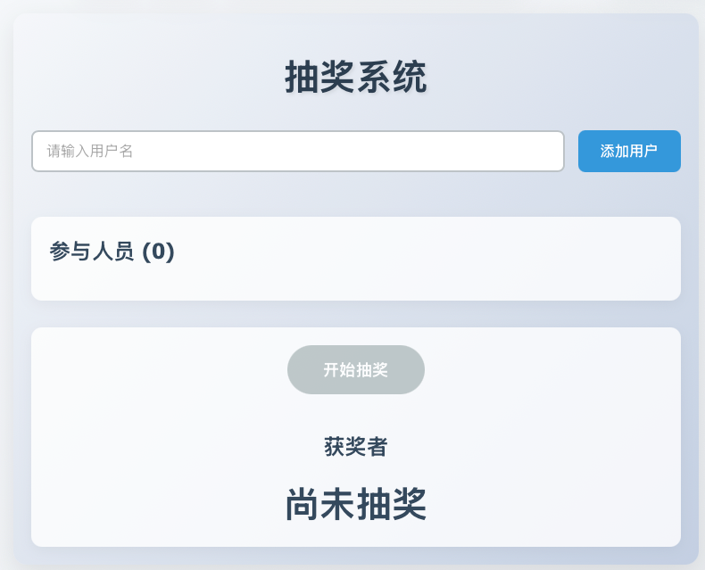

# 抽奖系统

这是一个基于React和Vite构建的在线抽奖系统，提供公平随机的抽奖功能和美观的用户界面。



## 功能特性

- **用户管理**：添加、删除和清空参与抽奖的用户
- **公平抽奖算法**：使用高质量的随机数生成算法确保公平性
- **动画效果**：流畅的抽奖动画提升用户体验
- **历史记录**：记录所有抽奖结果，支持查看历史中奖信息
- **响应式设计**：适配各种屏幕尺寸，在桌面和移动设备上都有良好表现
- **美观界面**：渐变背景和现代化UI设计

## 快速开始

### 方法1：使用Docker Compose（推荐）

```bash
# 启动服务（默认映射到8080端口）
docker-compose up -d

# 访问抽奖系统
# 打开浏览器，访问 http://localhost:8080
```

### 方法2：本地开发环境

```bash
# 安装依赖
npm install

# 启动开发服务器
npm run dev

# 访问抽奖系统
# 打开浏览器，访问 http://localhost:5173（端口可能会根据配置变化）
```

### 方法3：生产环境构建

```bash
# 安装依赖
npm install

# 构建项目
npm run build

# 预览生产版本
npm run preview

# 或者部署dist目录到任何静态文件服务器
```

## 使用说明

1. **添加用户**：在输入框中输入用户名，然后点击「添加」按钮或按回车键
2. **移除用户**：点击用户列表中对应用户的「移除」按钮
3. **清空用户**：点击「清空用户」按钮移除所有用户
4. **开始抽奖**：确保至少有一个用户，然后点击「开始抽奖」按钮
5. **停止抽奖**：抽奖过程中可以随时点击「停止抽奖」按钮
6. **查看历史**：历史记录区域会显示所有抽奖结果

## 项目结构

```
├── src/
│   ├── App.jsx       # 主应用组件，包含抽奖系统核心逻辑
│   ├── App.css       # 应用样式
│   ├── index.css     # 全局样式
│   └── main.jsx      # 应用入口
├── Dockerfile        # Docker构建文件
├── docker-compose.yml # Docker Compose配置
├── package.json      # 项目依赖配置
└── vite.config.js    # Vite配置
```

## Docker配置

项目包含完整的Docker支持，可以通过Docker Compose快速部署。Dockerfile采用多阶段构建，减小最终镜像体积：

- 第一阶段：使用Node.js环境构建React应用
- 第二阶段：使用Nginx提供静态文件服务

## 技术栈

- React 18
- Vite
- CSS3（包含动画和渐变）
- Docker & Docker Compose

## License

MIT
